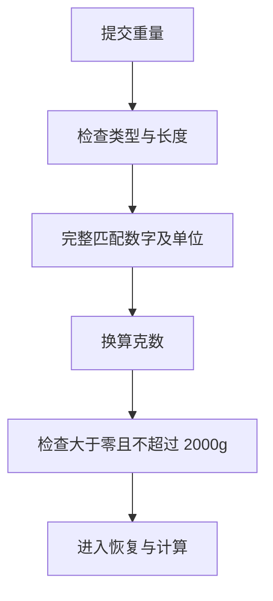

# 08 重量输入：先完整识别单位，再换算

[返回功能学习总目录](README.md)

将“0.5斤”“0.1kg”等明确重量转为克数。它不估计“一大碗”有多重，也不解析所有自然语言数量表达。

## 1. 核心能力

支持代码白名单中的克、千克/公斤、市斤和市两，拒绝无效单位、负数和超限结果。

## 2. 业务背景

只提取“100kg”里的数字 100，会误当成 100g。必须完整匹配单位，不能只抽取数字。

## 3. 整体执行流程



流程图展示主线；失败、追问等分支在下面对应步骤中说明。

## 4. 关键代码与设计理由

### 4.1 完整匹配比提取数字重要

[weight.py](../../backend/app/agent/weight.py) 的 `parse_weight_grams`：

```python
raw = str(value).strip()
match = _WEIGHT.fullmatch(raw) if len(raw) <= 80 else None
if match is None:
    raise InvalidWeightInput(message)
```

`100ml` 和 `100g左右` 不符合这个解析器的完整输入。“半斤”当前也不能直接通过，应该填 `0.5斤`。

### 4.2 换算之后再检查上限

单位表中斤乘 500、两乘 50、kg 乘 1000；之后检查结果是否在 `(0, 2000]`。因此 2kg 可通过、3kg 被拒绝。

[graph.py](../../backend/app/agent/graph.py) 的 `_decimal_answer` 接入它。合法重量只表示能计算，不代表重量符合照片里的实际份量。

## 5. 难懂语法

`fullmatch` 要求整串文字全部匹配。`re.IGNORECASE` 让 KG 与 kg 等价。Python 中布尔值与整数有继承关系，代码先排除 `bool`，避免把 True 当成数字。

## 6. 怎么验证、怎么继续读

读 [test_weight_input.py](../../backend/tests/unit/test_weight_input.py) 的换算、超限、非法单位和布尔值用例。适合直接运行单元测试。

读完试着回答：**为什么不能把 100ml 里的 100 当成 100g？**

---

本文解释当前代码行为；代码块为源码节选，省略外围逻辑，不能单独运行。示例用于讲解，不代表真实模型必然输出相同结果。测试执行范围见总目录。
