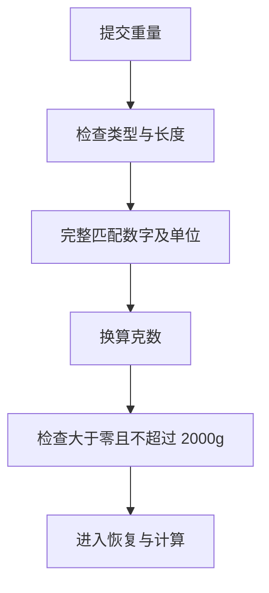

# 08 重量输入：先完整识别单位，再换算

[返回功能学习总目录](README.md)

将“0.5斤”“0.1kg”等明确重量转为克数。它不估计“一大碗”有多重，也不解析所有自然语言数量表达。

## 1. 先看一个实际例子

小林在重量输入框填写“0.5斤”。后端应得到 250g。我们再用“3kg”和“100ml”看为什么不能只取数字。

这个例子贯穿下面的执行过程。示例数据用于理解代码，不是线上测量或真实模型效果证明。

## 2. 为什么需要这样实现

只提取“100kg”里的数字 100，会误当成 100g。必须完整匹配单位，不能只抽取数字。

## 3. 一张图看懂全过程



图展示主线，失败与追问分支在第 5 节对照阅读。

## 4. 跟着这个例子读代码

以下为当前源码的连续节选，省略外围处理，不能单独运行。每一步都说明调用位置和数据去向。

### 4.1 检查类型，并完整匹配

**收到什么**

输入可以是支持的字符串或数值，本例为 0.5斤。

**代码在哪里**

[backend/app/agent/weight.py](../../backend/app/agent/weight.py) 的 `parse_weight_grams`。

```python
message = "请输入有效重量，例如 100g、0.1kg 或 2两；仅支持克、千克/公斤、市斤、市两。"
if isinstance(value, bool) or not isinstance(value, (str, int, float, Decimal)):
    raise InvalidWeightInput(message)
raw = str(value).strip()
match = _WEIGHT.fullmatch(raw) if len(raw) <= 80 else None
if match is None:
    raise InvalidWeightInput(message)
```

**为什么这样写**

必须完整匹配数字和单位。若只抽数字，100ml 会被错误当克数，100kg 可能被截成 100g。布尔值先排除。

**处理后变成什么，交给谁**

匹配得到数字 0.5 和单位 斤；不匹配则抛出固定的友好错误。半斤等中文数字当前不支持。

> 语法小注：`fullmatch` 要求整串输入匹配，不能多出“左右”等内容。

### 4.2 单位换算之后检查上限

**收到什么**

已经得到数值和单位；单位表中市斤为 500g，kg 为 1000g。

**代码在哪里**

[backend/app/agent/weight.py](../../backend/app/agent/weight.py) 的 `parse_weight_grams`。

```python
with localcontext() as context:
    context.prec = 100
    grams = Decimal(match[1]) * _GRAMS_PER_UNIT[(match[2] or "").lower()]
if not Decimal("0") < grams <= MAX_MEAL_WEIGHT_GRAMS:
    raise InvalidWeightInput("换算后的单项重量必须大于 0 且不超过 2000 克，请更正后提交。")
```

**为什么这样写**

先乘单位倍率，再检查结果大于零且不超过 2000g。否则 3kg 的数字 3 看似很小，却越过实际克数上限。

**处理后变成什么，交给谁**

0.5×500=250g 返回给调用方；3kg 换成 3000g 被拒绝。这个函数只解析明确重量，不估计照片份量。

> 语法小注：`localcontext` 临时调整 Decimal 精度，不影响调用者全局设置。

### 4.3 恢复流程消费解析结果

**收到什么**

用户通过当前问题提交重量，_decimal_answer 调用统一重量解析。

**代码在哪里**

[backend/app/agent/graph.py](../../backend/app/agent/graph.py) 的 `_apply_resume`。

```python
if question.field == "grams":
    grams = _decimal_answer(answer.get("grams"))
    if grams is None:
        return state
    changed[item_id] = item.model_copy(
        update={"grams": grams, "input_version": _next_version(item.input_version), "is_dirty": True}
    )
    continue
```

**为什么这样写**

无法解析就返回原状态；合法结果才写入食物项并提高版本。不能把输入失败变成零克。

**处理后变成什么，交给谁**

本例食物项 grams=250 且 is_dirty=True，下一步查目录并计算。输入合法并不证明用户真的吃了这个重量。

> 语法小注：`_next_version` 让后端区分修改前后的输入版本。

## 5. 换一种输入，会走哪条路

| 情况 | 判断与处理 | 应观察的结果 |
|---|---|---|
| 0.5斤 | 换算 250g | 通过 |
| 3kg | 换算后超限 | 拒绝 |
| 100ml 或 半斤 | 完整匹配失败 | 提示支持的输入格式 |

## 6. 自己验证一次

在仓库根目录执行现有测试，使用后端已安装的测试环境：

```bash
cd backend
.venv/bin/python -m pytest tests/unit/test_weight_input.py -q
```

观察单位换算后的克数以及拒绝案例。对照同样的数字使用 g 和 kg，理解上限为什么放在换算之后。

本轮运行范围与结果见[总目录验证记录](README.md)。替身测试证明指定输入下的代码行为，不能替代真实模型效果、数据库并发或页面验收。

## 7. 读完应该能回答什么

1. 为什么先换算再校验？
2. None 与 0 克有什么不同？
3. 重量合法能证明实际份量准确吗？

源码阅读顺序：[agent/weight.py](../../backend/app/agent/weight.py) → [agent/graph.py](../../backend/app/agent/graph.py)。先跟本例函数走一遍，再展开旁支。
